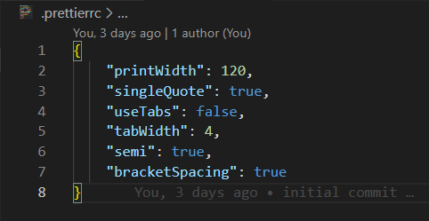

# Naming Convension

1. The variables must be named according with the data that they save ( we must know from the variable title what does it contain)
    - Example: public <b>location</b>: string;
2. If variable or method has boolean type you must name it with a prefix is, has, etc.
    - Example: private <b>isLoading</b>: boolean;
3. Methods are named with a operation which they perform. If method returns value you must name this method with a prefix get. Names of methods must be a verb.
    - Example: private <b>getId()</b>: number {}
4. If you have a composite variable or method you must use camelCase.
    - Example: public <b>isUserVisable</b>: boolean; private <b>getId()</b>: number {}
5. For html/css class use kebab-case.
    - Example: &lt;div class=”<b>user-card</b>”&gt;&lt;/div&gt;
6. File name must consist of 3 parts (for components, modules, directives, pipes, services, etc.):

-   class name (use kebab-case for it);
-   name of structural unit (service, component, etc.);
-   file extension (ts, html, scss)
    -   Example: <b>user-card.component.ts</b>

7. For class name use the same title from your file name but use PascalCase.
    - Example: class <b>UserCardComponent</b> {}
8. Enforce Prettier tool (check [<b>readme.md</b>](https://github.com/Agrinden/online-wallet/blob/main/README.md) file for it). Basic rules for Prettier - code formatter:

### Rules for expected git commit message style:

-   Separate subject from body with a blank line
-   Capitalize the subject line and each paragraph;
-   Use the imperative mood in the subject line;
-   Wrap lines at 72 characters;
-   Use the body to explain what and why you have done something. In most cases, you can leave out details about how a change has been made.

### Information in commit messages:

-   Describe why a change is being made.
-   How does it address the issue?
-   What effects does the patch have?
-   Do not assume the reviewer understands what the original problem was.
-   Do not assume the code is self-evident/self-documenting.
-   Read the commit message to see if it hints at improved code structure.
-   The first commit line is the most important.
-   You must start your commit with the task number from Trello board.
-   Describe any limitations of the current code.
-   Do not include patch set-specific comments.
    -   Commit example: git commit -m <b>'[1245] Added margin to nav items to prevent them from overlapping the logo'</b>

Read more about commit naming in [<b>this</b>](https://gist.github.com/robertpainsi/b632364184e70900af4ab688decf6f53#file-commit-message-guidelines-md) article.
